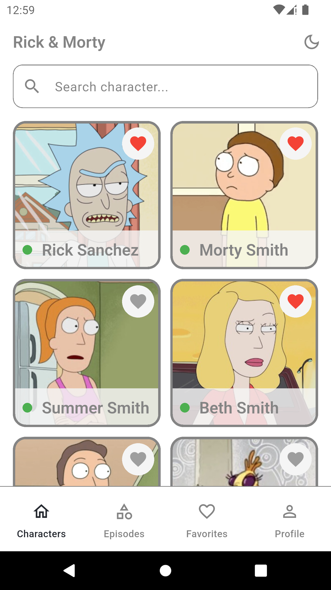
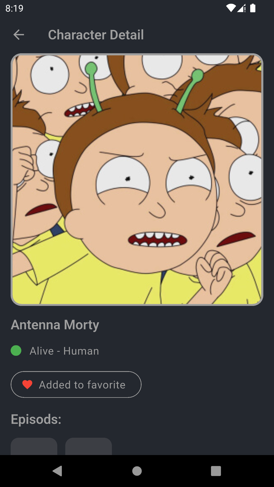
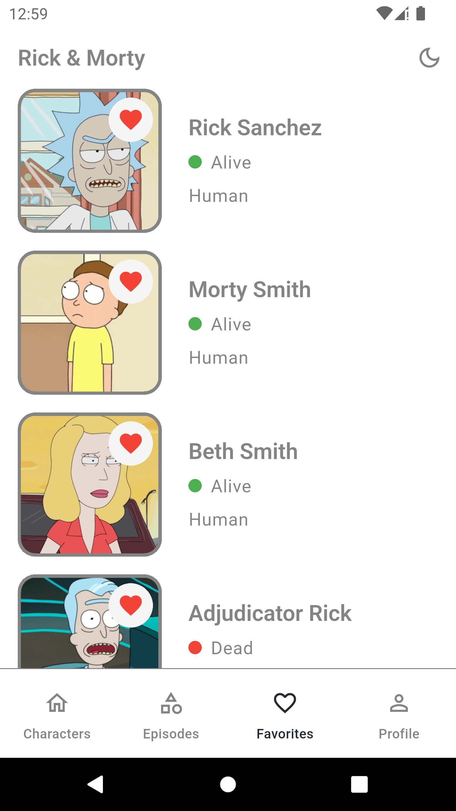
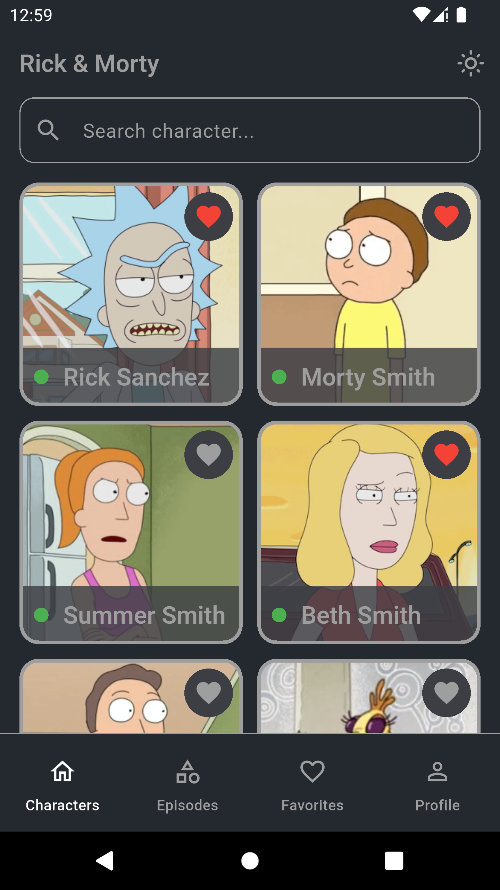
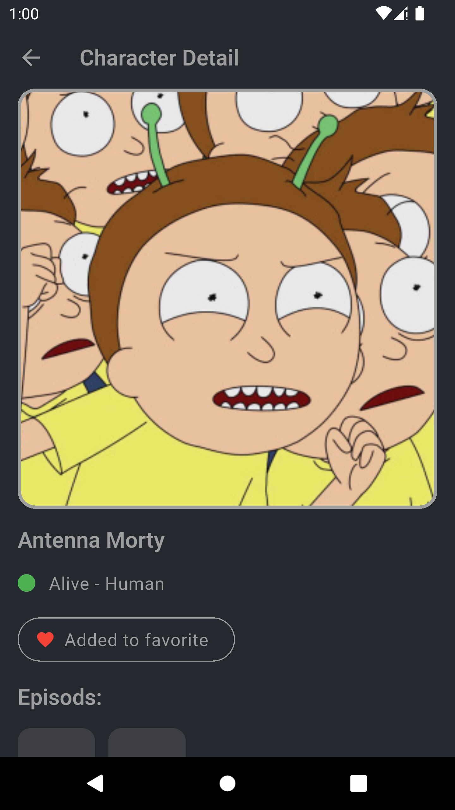
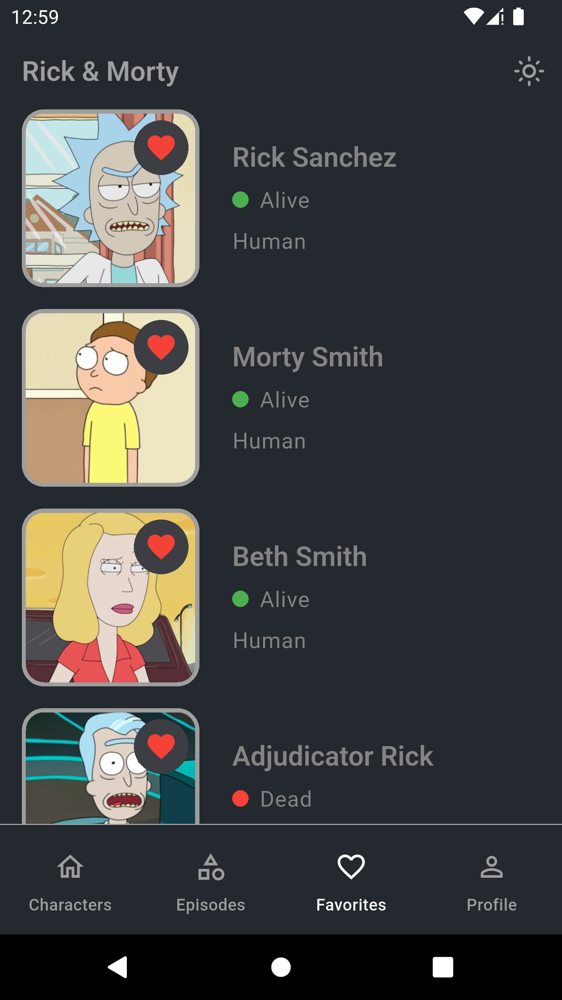
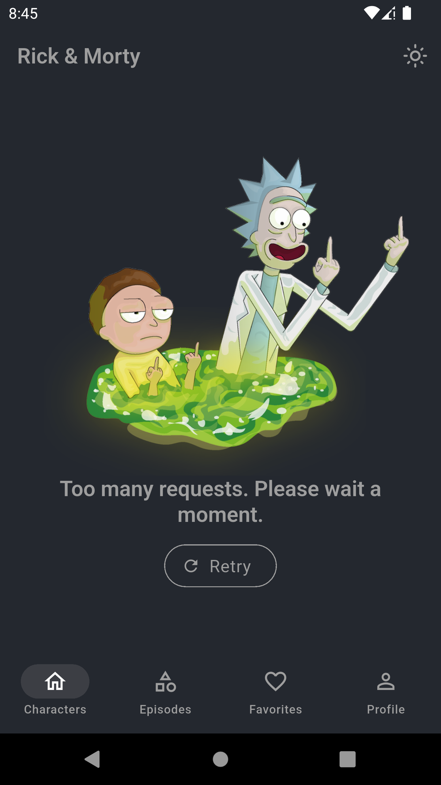
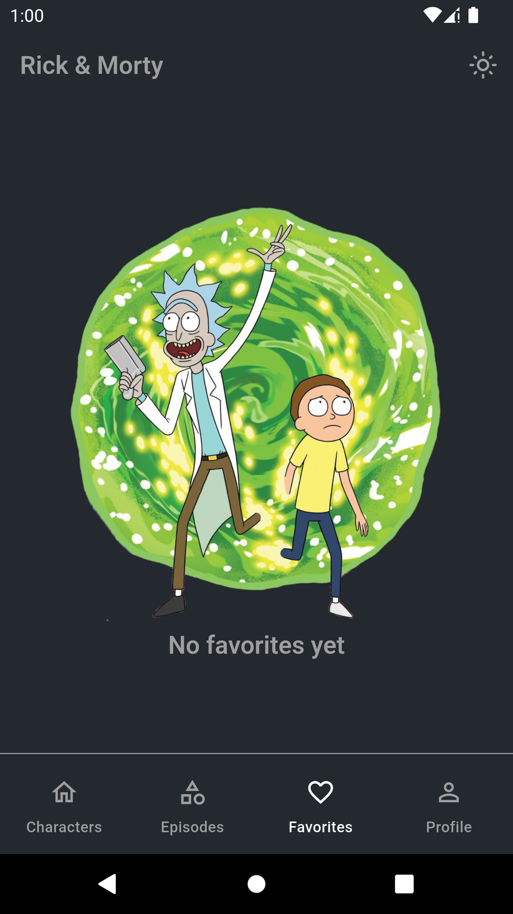

# 🧪 Rick & Morty Flutter App

Simple Flutter application working with the Rick & Morty REST API.

---

## 📱 Screenshots

| Characters | Detail | Favorites |
| :---: | :---: | :---: |
|  |  |  |
|  |  |  |
---

## ✨ Features

<table>
<tr>
<td>

- 📚 Characters list with pagination  
- 🔎 Search by name  
- 👤 Character detail  
- ❤️ Favorites  
- 💾 Hive persistence  
- 🌗 Dark / Light theme  
- ⚠️ Loading and error handling

</td>
<td>

</td>
</tr>
</table>

---
## 🏗 Architecture
<table>
<tr>
<td>

</td>
<td>

- **Feature-based structure** 
- **Layered separation (Presentation / Domain / Data)**  
- **BLoC state management** 
- **Repository pattern**  
- **RemoteDataSource / LocalDataSource**  
- **Dependency injection**  
</td>
</tr>
</table>

---

## 🛠 Technologies

- **State Management:** BLoC  
- **Networking:** Dio  
- **Local Storage:** Hive  
- **DI:** get_it  
- **Equality:** Equatable  

---

## 🎨 UI & UX


- **Custom light and dark themes** 
- **Hero animations between list and detail**  

---
## 🚀 Run

```bash
flutter pub get
flutter run